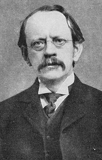

<table class="infobox vcard">
<tbody>
<tr>
<th colspan="2">

<a title="Sir" href="https://en.wikipedia.org/wiki/Sir">Sir</a>

 

J. J. Thomson

 

<a class="mw-redirect" title="Member of the Order of Merit" href="https://en.wikipedia.org/wiki/Member_of_the_Order_of_Merit">OM</a>&nbsp;<a class="mw-redirect" title="President of the Royal Society" href="https://en.wikipedia.org/wiki/President_of_the_Royal_Society">PRS</a>

</th>
</tr>
<tr>
<td colspan="2"></td>
</tr>
<tr>
<td colspan="2">&nbsp;</td>
</tr>
<tr>
<th colspan="2">42nd&nbsp;<a class="mw-redirect" title="President of the Royal Society" href="https://en.wikipedia.org/wiki/President_of_the_Royal_Society">President of the Royal Society</a></th>
</tr>
<tr>
<td colspan="2"><strong>In office</strong> 1915&ndash;1920</td>
</tr>
<tr>
<th scope="row">Preceded by</th>
<td><a title="William Crookes" href="https://en.wikipedia.org/wiki/William_Crookes">William Crookes</a></td>
</tr>
<tr>
<th scope="row">Succeeded by</th>
<td><a title="Charles Scott Sherrington" href="https://en.wikipedia.org/wiki/Charles_Scott_Sherrington">Charles Scott Sherrington</a></td>
</tr>
<tr>
<th colspan="2">Master of&nbsp;<a title="Trinity College, Cambridge" href="https://en.wikipedia.org/wiki/Trinity_College,_Cambridge">Trinity College, Cambridge</a></th>
</tr>
<tr>
<td colspan="2"><strong>In office</strong> 1918&ndash;1940</td>
</tr>
<tr>
<th scope="row">Preceded by</th>
<td><a title="Henry Montagu Butler" href="https://en.wikipedia.org/wiki/Henry_Montagu_Butler">Henry Montagu Butler</a></td>
</tr>
<tr>
<th scope="row">Succeeded by</th>
<td><a class="mw-redirect" title="George Macaulay Trevelyan" href="https://en.wikipedia.org/wiki/George_Macaulay_Trevelyan">George Macaulay Trevelyan</a></td>
</tr>
<tr>
<th colspan="2">Personal details</th>
</tr>
<tr>
<th scope="row">Born</th>
<td>

Joseph John Thomson

 18 December 1856 <a class="mw-redirect" title="Cheetham Hill" href="https://en.wikipedia.org/wiki/Cheetham_Hill">Cheetham Hill</a>,&nbsp;<a title="Manchester" href="https://en.wikipedia.org/wiki/Manchester">Manchester</a>, England</td>
</tr>
<tr>
<th scope="row">Died</th>
<td>30 August 1940&nbsp;(aged&nbsp;83) <a title="Cambridge" href="https://en.wikipedia.org/wiki/Cambridge">Cambridge</a>, England</td>
</tr>
<tr>
<th scope="row">Citizenship</th>
<td>British</td>
</tr>
<tr>
<th scope="row">Nationality</th>
<td><a title="English people" href="https://en.wikipedia.org/wiki/English_people">English</a></td>
</tr>
<tr>
<th scope="row">Children</th>
<td><a title="George Paget Thomson" href="https://en.wikipedia.org/wiki/George_Paget_Thomson">George Paget Thomson</a>, Joan Paget Thomson</td>
</tr>
<tr>
<th scope="row"><a title="Alma mater" href="https://en.wikipedia.org/wiki/Alma_mater">Alma mater</a></th>
<td><a class="mw-redirect" title="Owens College" href="https://en.wikipedia.org/wiki/Owens_College">Owens College</a>&nbsp;(now the&nbsp;<a title="University of Manchester" href="https://en.wikipedia.org/wiki/University_of_Manchester">University of Manchester</a>) <a title="Trinity College, Cambridge" href="https://en.wikipedia.org/wiki/Trinity_College,_Cambridge">Trinity College, Cambridge</a>&nbsp;(BA)</td>
</tr>
<tr>
<th scope="row">Signature</th>
<td></td>
</tr>
<tr>
<td colspan="2">&nbsp;</td>
</tr>
<tr>
<th scope="row">Known&nbsp;for</th>
<td><a title="Plum pudding model" href="https://en.wikipedia.org/wiki/Plum_pudding_model">Plum pudding model</a> <a title="Electron" href="https://en.wikipedia.org/wiki/Electron">Discovery of electron</a> <a class="mw-redirect" title="Isotopes" href="https://en.wikipedia.org/wiki/Isotopes">Discovery of isotopes</a> <a class="mw-redirect" title="Mass spectrometer" href="https://en.wikipedia.org/wiki/Mass_spectrometer">Mass spectrometer invention</a> <a title="Mass-to-charge ratio" href="https://en.wikipedia.org/wiki/Mass-to-charge_ratio">First m/e measurement</a> <a class="mw-redirect" title="Waveguide (electromagnetism)" href="https://en.wikipedia.org/wiki/Waveguide_(electromagnetism)">Proposed first waveguide</a> <a title="Thomson scattering" href="https://en.wikipedia.org/wiki/Thomson_scattering">Thomson scattering</a> <a title="Thomson problem" href="https://en.wikipedia.org/wiki/Thomson_problem">Thomson problem</a> <a title="Delta ray" href="https://en.wikipedia.org/wiki/Delta_ray">Coining term 'delta ray'</a> <a class="mw-redirect" title="Epsilon radiation" href="https://en.wikipedia.org/wiki/Epsilon_radiation">Coining term 'epsilon radiation'</a> <a title="Thomson (unit)" href="https://en.wikipedia.org/wiki/Thomson_(unit)">Thomson (unit)</a></td>
</tr>
<tr>
<th scope="row">Awards</th>
<td><a title="Smith's Prize" href="https://en.wikipedia.org/wiki/Smith%27s_Prize">Smith's Prize</a>&nbsp;(1880) <a title="Royal Medal" href="https://en.wikipedia.org/wiki/Royal_Medal">Royal Medal</a>&nbsp;(1894) <a title="Hughes Medal" href="https://en.wikipedia.org/wiki/Hughes_Medal">Hughes Medal</a>&nbsp;(1902) <a title="Nobel Prize in Physics" href="https://en.wikipedia.org/wiki/Nobel_Prize_in_Physics">Nobel Prize in Physics</a>&nbsp;(1906) <a title="Elliott Cresson Medal" href="https://en.wikipedia.org/wiki/Elliott_Cresson_Medal">Elliott Cresson Medal</a>&nbsp;(1910) <a title="Copley Medal" href="https://en.wikipedia.org/wiki/Copley_Medal">Copley Medal</a>&nbsp;(1914) <a title="Albert Medal (Royal Society of Arts)" href="https://en.wikipedia.org/wiki/Albert_Medal_(Royal_Society_of_Arts)">Albert Medal</a>&nbsp;(1915) <a title="Franklin Medal" href="https://en.wikipedia.org/wiki/Franklin_Medal">Franklin Medal</a>&nbsp;(1922) <a class="mw-redirect" title="Faraday Medal" href="https://en.wikipedia.org/wiki/Faraday_Medal">Faraday Medal</a>&nbsp;(1925) <a class="mw-redirect" title="Dalton Medal" href="https://en.wikipedia.org/wiki/Dalton_Medal">Dalton Medal</a>&nbsp;(1931)</td>
</tr>
<tr>
<td colspan="2"><strong>Scientific career</strong></td>
</tr>
<tr>
<th scope="row">Fields</th>
<td class="category"><a title="Physics" href="https://en.wikipedia.org/wiki/Physics">Physics</a></td>
</tr>
<tr>
<th scope="row">Institutions</th>
<td><a title="Trinity College, Cambridge" href="https://en.wikipedia.org/wiki/Trinity_College,_Cambridge">Trinity College, Cambridge</a></td>
</tr>
<tr>
<th scope="row">Academic advisors</th>
<td><a class="mw-redirect" title="John Strutt, 3rd Baron Rayleigh" href="https://en.wikipedia.org/wiki/John_Strutt,_3rd_Baron_Rayleigh">John Strutt (Rayleigh)</a> <a class="mw-redirect" title="Edward John Routh" href="https://en.wikipedia.org/wiki/Edward_John_Routh">Edward John Routh</a></td>
</tr>
<tr>
<th scope="row">Notable students</th>
<td><a title="Charles Glover Barkla" href="https://en.wikipedia.org/wiki/Charles_Glover_Barkla">Charles Glover Barkla</a> <a class="mw-redirect" title="Charles T. R. Wilson" href="https://en.wikipedia.org/wiki/Charles_T._R._Wilson">Charles T. R. Wilson</a> <a title="Ernest Rutherford" href="https://en.wikipedia.org/wiki/Ernest_Rutherford">Ernest Rutherford</a> <a title="Francis William Aston" href="https://en.wikipedia.org/wiki/Francis_William_Aston">Francis William Aston</a> <a class="mw-redirect" title="John Sealy Edward Townsend" href="https://en.wikipedia.org/wiki/John_Sealy_Edward_Townsend">John Townsend</a> <a title="J. Robert Oppenheimer" href="https://en.wikipedia.org/wiki/J._Robert_Oppenheimer">J. Robert Oppenheimer</a> <a title="Owen Willans Richardson" href="https://en.wikipedia.org/wiki/Owen_Willans_Richardson">Owen Richardson</a> <a title="William Henry Bragg" href="https://en.wikipedia.org/wiki/William_Henry_Bragg">William Henry Bragg</a> <a title="H. Stanley Allen" href="https://en.wikipedia.org/wiki/H._Stanley_Allen">H. Stanley Allen</a> <a title="John Zeleny" href="https://en.wikipedia.org/wiki/John_Zeleny">John Zeleny</a> <a title="Daniel Frost Comstock" href="https://en.wikipedia.org/wiki/Daniel_Frost_Comstock">Daniel Frost Comstock</a> <a title="Max Born" href="https://en.wikipedia.org/wiki/Max_Born">Max Born</a> <a title="T. H. Laby" href="https://en.wikipedia.org/wiki/T._H._Laby">T. H. Laby</a> <a title="Paul Langevin" href="https://en.wikipedia.org/wiki/Paul_Langevin">Paul Langevin</a> <a title="Balthasar van der Pol" href="https://en.wikipedia.org/wiki/Balthasar_van_der_Pol">Balthasar van der Pol</a> <a class="mw-redirect" title="Geoffrey Ingram Taylor" href="https://en.wikipedia.org/wiki/Geoffrey_Ingram_Taylor">Geoffrey Ingram Taylor</a> <a title="Niels Bohr" href="https://en.wikipedia.org/wiki/Niels_Bohr">Niels Bohr</a> <a title="George Paget Thomson" href="https://en.wikipedia.org/wiki/George_Paget_Thomson">George Paget Thomson</a> <a title="Debendra Mohan Bose" href="https://en.wikipedia.org/wiki/Debendra_Mohan_Bose">Debendra Mohan Bose</a> <a title="Lawrence Bragg" href="https://en.wikipedia.org/wiki/Lawrence_Bragg">Lawrence Bragg</a></td>
</tr>
</tbody>
</table>
 

<strong>Sir Joseph John Thomson</strong>&nbsp;<a class="mw-redirect" title="Member of the Order of Merit" href="https://en.wikipedia.org/wiki/Member_of_the_Order_of_Merit">OM</a>&nbsp;<a class="mw-redirect" title="President of the Royal Society" href="https://en.wikipedia.org/wiki/President_of_the_Royal_Society">PRS</a>&nbsp;(18 December 1856 &ndash; 30 August 1940) was a British&nbsp;<a title="Physicist" href="https://en.wikipedia.org/wiki/Physicist">physicist</a>&nbsp;and&nbsp;<a title="Nobel Prize in Physics" href="https://en.wikipedia.org/wiki/Nobel_Prize_in_Physics">Nobel Laureate in Physics</a>, credited with the discovery of the&nbsp;<a title="Electron" href="https://en.wikipedia.org/wiki/Electron">electron</a>, the first&nbsp;<a title="Subatomic particle" href="https://en.wikipedia.org/wiki/Subatomic_particle">subatomic particle</a>&nbsp;to be discovered.

In 1897, Thomson showed that&nbsp;<a title="Cathode ray" href="https://en.wikipedia.org/wiki/Cathode_ray">cathode rays</a>&nbsp;were composed of previously unknown negatively charged particles (now called electrons), which he calculated must have bodies much smaller than atoms and a very large&nbsp;<a class="mw-redirect" title="Charge-to-mass ratio" href="https://en.wikipedia.org/wiki/Charge-to-mass_ratio">charge-to-mass ratio</a>.&nbsp;Thomson is also credited with finding the first evidence for&nbsp;<a title="Isotope" href="https://en.wikipedia.org/wiki/Isotope">isotopes</a>&nbsp;of a stable (non-radioactive) element in 1913, as part of his exploration into the composition of&nbsp;<a class="mw-redirect" title="Canal ray" href="https://en.wikipedia.org/wiki/Canal_ray">canal rays</a>&nbsp;(positive ions). His experiments to determine the nature of positively charged particles, with&nbsp;<a title="Francis William Aston" href="https://en.wikipedia.org/wiki/Francis_William_Aston">Francis William Aston</a>, were the first use of&nbsp;<a title="Mass spectrometry" href="https://en.wikipedia.org/wiki/Mass_spectrometry">mass spectrometry</a>&nbsp;and led to the development of the mass spectrograph.

Thomson was awarded the 1906&nbsp;<a title="Nobel Prize in Physics" href="https://en.wikipedia.org/wiki/Nobel_Prize_in_Physics">Nobel Prize in Physics</a>&nbsp;for his work on the conduction of electricity in gases.

 

<strong> Publications: </strong>

<ul>

 <li><a target="_blank" href="https://github.com/manjunath5496/Joseph-John-Thomson-Publications/blob/master/tst(260).pdf" style="text-decoration:none;">Applications of dynamics to physics and chemistry</a></li>
                            
 <li><a target="_blank" href="https://github.com/manjunath5496/Joseph-John-Thomson-Publications/blob/master/tst(261).rar" style="text-decoration:none;">Conduction of electricity through gases</a></li>

<li><a target="_blank" href="https://github.com/manjunath5496/Joseph-John-Thomson-Publications/blob/master/tst(262).pdf" style="text-decoration:none;">The Corpuscular Theory of Matter</a></li>
 <li><a target="_blank" href="https://github.com/manjunath5496/Joseph-John-Thomson-Publications/blob/master/tst(263).pdf" style="text-decoration:none;">Electricity and Matter</a></li>                              

 <li><a target="_blank" href="https://github.com/manjunath5496/Joseph-John-Thomson-Publications/blob/master/tst(264).pdf" style="text-decoration:none;">Elements of the Mathematical Theory of Electricity and Magnetism</a></li>
                            
 <li><a target="_blank" href="https://github.com/manjunath5496/Joseph-John-Thomson-Publications/blob/master/tst(265).pdf" style="text-decoration:none;">On the Light Thrown by Recent Investigations on Electricity on the Relation Between Matter and Ether</a></li>                              

 <li><a target="_blank" href="https://github.com/manjunath5496/Joseph-John-Thomson-Publications/blob/master/tst(266).pdf" style="text-decoration:none;">Rays of Positive Electricity and their Application to Chemical Analysis</a></li>
                            
 <li><a target="_blank" href="https://github.com/manjunath5496/Joseph-John-Thomson-Publications/blob/master/tst(267).pdf" style="text-decoration:none;">A Text-Book of Physics</a></li>                              

 <li><a target="_blank" href="https://github.com/manjunath5496/Joseph-John-Thomson-Publications/blob/master/tst(268).pdf" style="text-decoration:none;">Carriers of negative electricity [Nobel Lecture]</a></li>

</ul>

 
